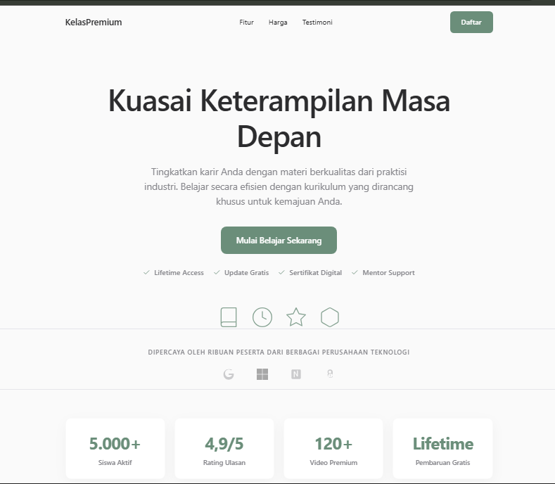
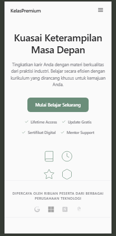

# KelasPremium 🎓

A premium, modern, and high-converting course landing page designed with an Apple-like minimalist aesthetic. Built strictly with raw HTML, CSS, and vanilla JavaScript without any external libraries or frameworks.

## ✨ Preview


## 🚀 Features

- **Apple-Like Minimalist UI:** Ultra-clean, premium aesthetic with smooth hover transitions, subtle shadows, and a sophisticated HSL color palette.
- **Single File Build:** The entire codebase (HTML, internal CSS, and internal JavaScript) is housed in one lightweight file for quick deployment.
- **SEO & Social Share Ready:** Fully optimized with open graph tags, Twitter cards, meta descriptions, search-engine friendly HTML5 tags, and structured JSON-LD schemas.
- **Social Proof & Stats:** Includes horizontal stats cards with dynamic number-rolling counter animations on scroll.
- **Partner / Trust Logos:** Grayscale credibility banners with elegant hover opacity transitions.
- **Interactive Syllabus & Preview:** Dual-column layout featuring an interactive CSS-based dashboard mockup on the left and a modular course curriculum list on the right.
- **Pulsing Play & Video Modal:** A modern video thumbnail with a pulsing animation that pops open a native HTML5 video modal when clicked.
- **Smooth FAQ Accordion:** Clean accordion menu with smooth opening/closing grid animations and full keyboard accessibility support (Space & Enter).
- **Responsive Trust Badges:** Credibility markers near pricing tables ensuring secure payment, lifetime access, instant updates, and refund guarantees.
- **Sticky Blur Navbar:** Semi-transparent header that implements a blur filter on scroll.
- **Testimonial Carousel:** Multi-slide customer feedback carousel with indicator dots.
- **Mobile Floating CTA:** A bottom-anchored CTA button on mobile viewports that slides into view upon scrolling past the fold.

## 🛠 Tech Stack


## 📁 Project Structure

```
.
├── landing_page_kelaspremium.html
├── instructor_avatar.png
├── preview.png
└── README.md
```

## 🎨 Design Philosophy

Inspired by Apple’s product design, the layout focuses on maximum white space, sleek readability, and zero clutter:
- **Clean Layouts:** Plenty of negative space to direct user attention to CTA conversion points.
- **Minimal Color Palette:** Uses soft, neutral greens (`#6B8E7A`) paired with off-whites and dark grays to mimic premium physical branding.
- **Elegant Spacing:** Standardized margins and responsive grids.
- **Soft Shadows & Curves:** Clean border radius (`12px`) and subtle drop-shadows that react gracefully on hover.
- **Smooth Animations:** Lightweight transitions (duration 500–700ms) triggered using browser-native APIs.

## ⚡ Performance

- **Zero Frameworks:** Written in vanilla JavaScript and pure CSS to achieve instant Time to Interactive.
- **No Dependencies:** No external CDNs, fonts, or JS modules are loaded, eliminating render-blocking requests.
- **Single File:** Everything required to render the landing page is packed into one file.
- **Fast Load:** Instant page loading and low data footprints.
- **Mobile Friendly:** Fully responsive layout catering to devices of all sizes.

## 📱 Responsive

| Viewport | Device Support | Status |
| :--- | :--- | :---: |
| **Desktop** | Large Monitors & Laptops | ✅ Fully Supported |
| **Tablet** | iPad, Portrait Laptops | ✅ Fully Supported |
| **Mobile** | iPhone & Android Viewports | ✅ Fully Supported |

## 📸 Screenshots

### Desktop



### Mobile



## 🚀 Getting Started

To run this project locally, clone the repository and open the HTML file:

```bash
git clone https://github.com/USERNAME/REPOSITORY.git
cd REPOSITORY
```

Then:
Open `landing_page_kelaspremium.html` in your browser of choice.

## 📌 Customization

You can quickly tailor this landing page by editing the internal styles in `landing_page_kelaspremium.html`:
- **Colors:** Adjust the HSL variables at the top of the `:root` rule (e.g., `--accent`, `--bg-main`).
- **Typography:** Change the font-family stack in the `body` selector.
- **Hero & Content:** Search for sections matching `<section id="hero">` to replace headlines.
- **Pricing:** Update rates and checkmarks inside the `<div class="pricing-grid">` containers.
- **Testimonials:** Modify author names and feedback paragraphs inside the carousel slides.

## 🤝 Contributing

Contributions make the open-source community an amazing place to learn and create.
1. Fork the Project.
2. Create your Feature Branch (`git checkout -b feature/AmazingFeature`).
3. Commit your Changes (`git commit -m 'Add some AmazingFeature'`).
4. Push to the Branch (`git push origin feature/AmazingFeature`).
5. Open a Pull Request.

## 📄 License

Distributed under the MIT License. See `LICENSE` for more information.

## ⭐ Support

If you like this project, don't forget to leave a ⭐ on GitHub!
